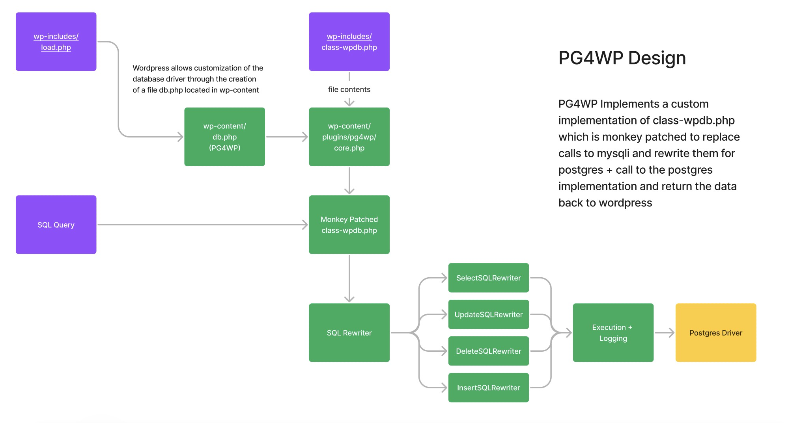

## PostgreSQL for WordPress (PG4WP) 

### Contributors
Code originally by Hawk__ (http://www.hawkix.net/)
Modifications by @kevinoid and @mattbucci

PostgreSQL for WordPress is a special 'plugin' enabling WordPress to be used with a PostgreSQL database.

### Description 

PostgreSQL for WordPress (PG4WP) gives you the possibility to install and use WordPress with a PostgreSQL database as a backend.
It works by replacing calls to MySQL specific functions with generic calls that maps them to another database functions and rewriting SQL queries on the fly when needed.

If you want to use this plugin, you should be aware of the following :
- WordPress with PG4WP is expected to be slower than the original WordPress with MySQL because PG4WP does much SQL rewriting for any page view
- Some WordPress plugins should work 'out of the box' but many plugins won't because they would need specific code in PG4WP

### Design

PostgreSQL for Wordpress works by intercepting calls to the mysqli_ driver in wordpress's wpdb class.
it replaces calls to mysqli_ with wpsqli_ which then are implemented by the driver files found in this plugin. 

### Supported Wordpress Versions

This plugin has been tested against Wordpress 6.3.2

### Supported PHP versions

This plugin requires PHP 8.1 or greater

### Supported PostgreSQL versions

This plugin has been tested on PostgreSQL 14.2

### Plugin Support

You shouldn't expect any plugin specific code to be integrated into PG4WP except for plugins shipped with WordPress itself (such as Akismet).
PG4WP 2.0 will have a mechanism to add plugin support.

| Plugin                 | Version     | Working   |
| -----------            | ----------- | --------- |
| Debug Bar              | 1.1.4       | Confirmed |
| Yoast Duplicate Post   | 4.2         | Confirmed |

### Theme Support

| Theme                 | Version     | Working   |
| -----------           | ----------- | --------- |
| Twenty Twenty-Three   | 1.2         | Confirmed |
| Twenty Twenty-Two     | 1.5         | Confirmed |
| Twenty Twenty-One     | 1.9         | Confirmed |

### Installation

You have to install PG4WP *before* configuring your WordPress installation for things to work properly. 
This is because the database needs to be up and running before any plugin can be loaded.

1.  Place your WordPress files in the right place on your web server.

1.  Download the latest release From the [releases page](https://github.com/PostgreSQL-For-Wordpress/postgresql-for-wordpress/releases)

1.	Unzip the files from PG4WP and put the `pg4wp` directory in your `/wp-content` directory.

1.	Copy the `db.php` from the `pg4wp` directory to `wp-content`
	
	You can modify this file to configure the database driver you wish to use
	Currently you can set 'DB_DRIVER' to 'pgsql' or 'mysql'
	
	You can also activate DEBUG and/or ERROR logs

1.	Create `wp-config.php` from `wp-config-sample.php` if it does not already exist (PG4WP does not currently intercept database connection setup).

1.	Point your Web Browser to your WordPress installation and go through the traditional WordPress installation routine.

### Contributing

Contributions are welcome, please open a pull request with your changes and make sure the tests pass by running the test suite using
`./tests/tools/phpunit.phar tests/`

If you find a failing scenario please add a test for it, A PR which fixes a scenario but does not include a test will not be accepted. 

### License
PG4WP is provided "as-is" with no warranty in the hope it can be useful.

PG4WP is licensed under the [GNU GPL](http://www.gnu.org/licenses/gpl.html "GNU GPL") v2 or any newer version at your choice.
